# 📊 Báo Cáo Triển Khai Blog Microservices

## 📋 Thông Tin Dự Án

| Thông tin | Chi tiết |
|-----------|----------|
| **Tên dự án** | Blog Microservices |
| **Kiến trúc** | Microservices |
| **Ngôn ngữ chính** | TypeScript, JavaScript |
| **Ngày báo cáo** | 24/6/2025 |
| **Người thực hiện** | Nguyễn Quốc Khánh - 22127188 |

## 🎯 Mục Tiêu Triển Khai

Triển khai thành công hệ thống Blog Microservices bằng 3 phương pháp khác nhau:
1. **PM2** - Process Manager cho Node.js
2. **Docker Compose** - Containerization
3. **Railway** - Cloud Platform

## 🏗️ Kiến Trúc Hệ Thống

### Các Microservices
- **API Gateway** (Port 8080): Điểm vào duy nhất cho client
- **User Service** (Port 3001): Quản lý người dùng và xác thực
- **Post Service** (Port 3002): Quản lý bài viết
- **Feed Service** (Port 3003): Tạo feed cá nhân hóa
- **Frontend** (Port 3000): Giao diện người dùng

### Infrastructure Components
- **PostgreSQL**: Database cho User và Post services
- **Redis**: Cache cho Feed service
- **Kafka**: Message queue cho event-driven communication
- **Consul**: Service discovery và health checking

---

## 🚀 Phương Pháp 1: Triển Khai với PM2

### 📝 Mô Tả
PM2 là process manager cho Node.js applications, cho phép quản lý và monitor các processes một cách hiệu quả.

### 🔧 Cấu Hình

#### File cấu hình chính
```bash
script/ecosystem.dev.config.js
```

#### Các bước cấu hình:

**Bước 1: Cài đặt dependencies**
```bash
npm install
cd api-gateway && npm install
cd ../user-service && npm install
cd ../post-service && npm install
cd ../feed-service && npm install
cd ../Frontend && npm install
```

**Bước 2: Khởi động infrastructure**
Tôi dùng các dịch vụ infrastructure cloud sau:
redis: cloud.redis.io
Apache Kafka: Confluent Cloud
Postgres: Neon

**Bước 3: Build TypeScript services**
```bash
cd user-service && npm run build
cd ../post-service && npm run build
cd ../feed-service && npm run build
```

**Bước 4: Khởi động với PM2**
```bash
pm2 start script/ecosystem.dev.config.js
```
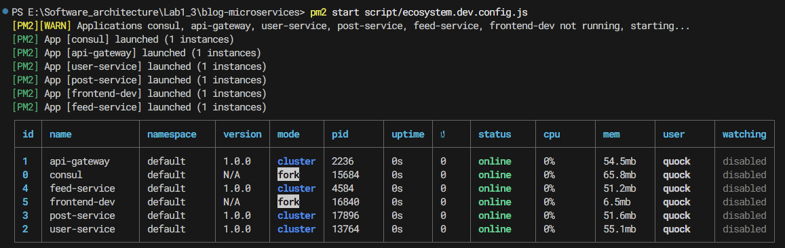
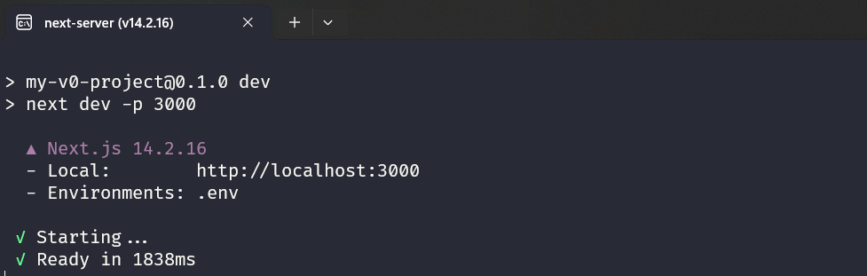
### 📊 Kết Quả

#### PM2 Status
```bash
pm2 status
```
[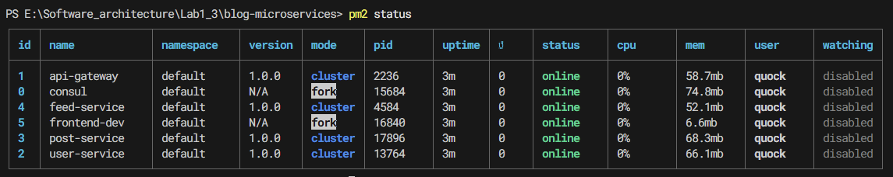]

#### PM2 Monitoring
```bash
pm2 monit
```
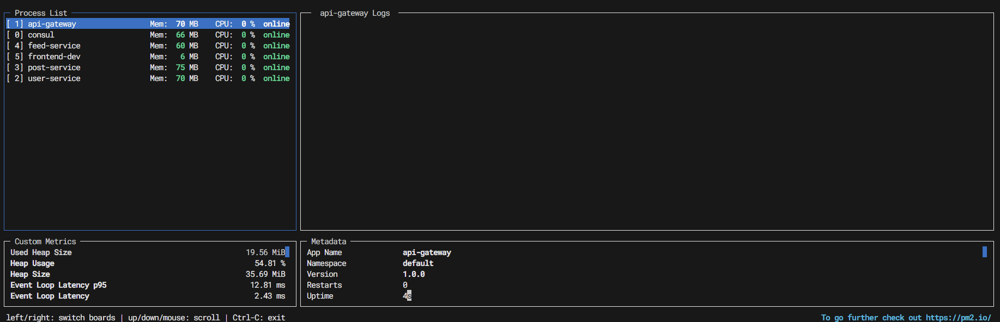


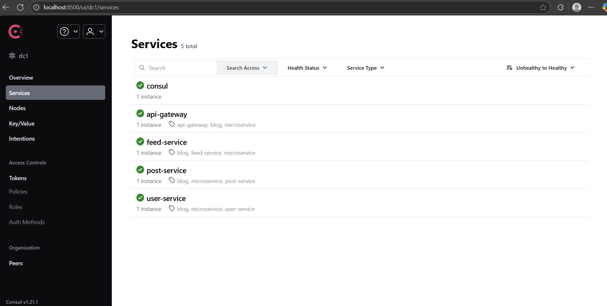
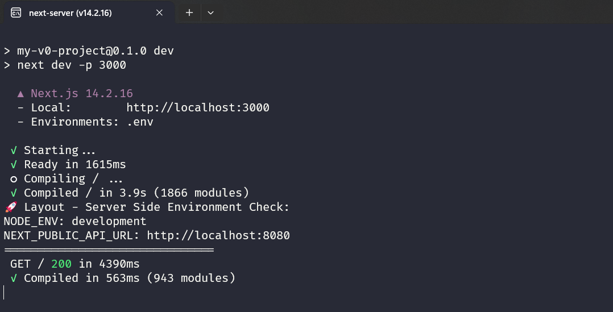
#### Application Access
- **Frontend**: http://localhost:3000
- **API Gateway**: http://localhost:8080
- **Consul UI**: http://localhost:8500

**Hình ảnh**: [Đính kèm screenshots của từng service đang chạy]

### ✅ Ưu Điểm
- Quản lý process dễ dàng
- Auto-restart khi crash
- Built-in monitoring
- Log management tự động
- Cluster mode support

### ❌ Nhược Điểm
- Phụ thuộc vào môi trường local
- Không có isolation hoàn toàn
- Phức tạp khi scale

### 📈 Metrics và Logs
```bash
pm2 logs api-gateway
pm2 logs user-service
pm2 logs post-service
pm2 logs feed-service
```
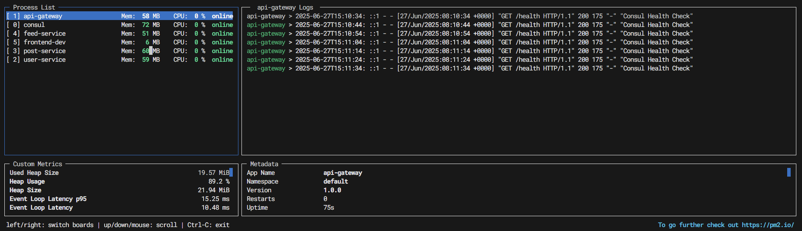
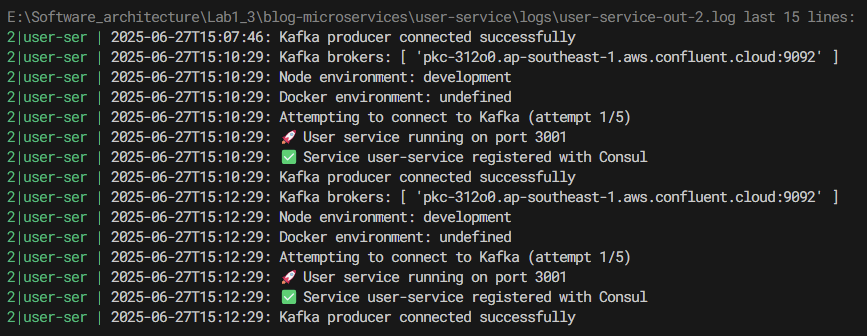

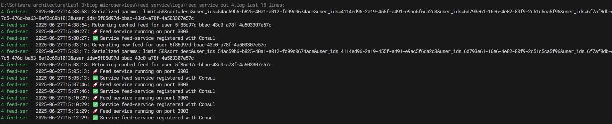


---

## 🐳 Phương Pháp 2: Triển Khai với Docker Compose

### 📝 Mô Tả
Docker Compose cho phép định nghĩa và chạy multi-container Docker applications với isolation hoàn toàn.

### 🔧 Cấu Hình

#### File cấu hình chính
```bash
docker-compose.yml
```

#### Các Dockerfile cho từng service:
- `api-gateway/Dockerfile`
- `user-service/Dockerfile`
- `post-service/Dockerfile`
- `feed-service/Dockerfile`
- `Frontend/Dockerfile`

#### Các bước cấu hình:

**Bước 1: Build containers**
```bash
docker-compose build
```

**Bước 2: Khởi động infrastructure và services**
```bash
docker-compose up -d 
```
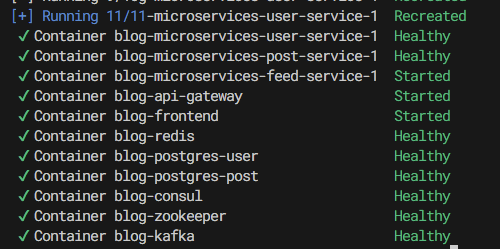

**Bước 3: Verify deployment**
```bash
docker-compose ps
```

### 📊 Kết Quả

#### Container Status
```bash
docker-compose ps
```
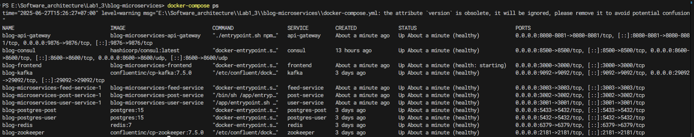

#### Container Logs
```bash
docker-compose logs api-gateway
docker-compose logs user-service
```
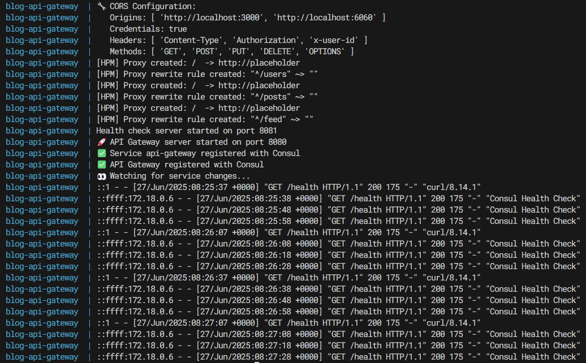

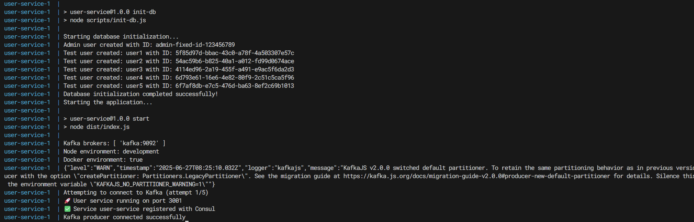

#### Resource Usage
```bash
docker stats
```
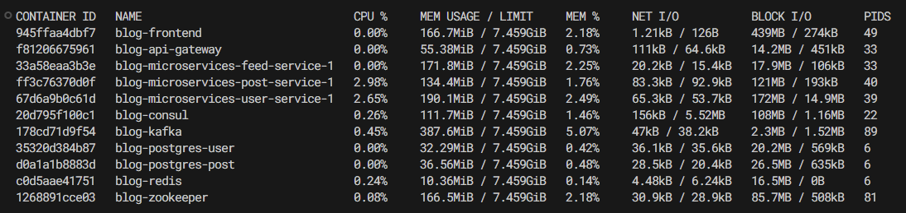

#### Application Access
- **Frontend**: http://localhost:3000
- **API Gateway**: http://localhost:8080
- **Consul UI**: http://localhost:8500

**Hình ảnh**: [Đính kèm screenshots của application running trong containers]

### ✅ Ưu Điểm
- Isolation hoàn toàn
- Consistent environment
- Easy scaling
- Infrastructure as code
- Cross-platform compatibility

### ❌ Nhược Điểm
- Resource overhead
- Learning curve
- Network complexity
- Storage management

---

## ☁️ Phương Pháp 3: Triển Khai trên Railway

### 📝 Mô Tả
Railway là cloud platform cho phép deploy applications dễ dàng với automatic scaling và managed infrastructure.

### 🔧 Cấu Hình

#### Các bước cấu hình:

**Bước 1: Build và push Docker images lên Docker Hub**
```bash
# Build images từ docker-compose
docker-compose build

# Tag images cho Docker Hub
docker tag blog-microservices_user-service quockhanh41/blog-user-service:latest
docker tag blog-microservices_post-service quockhanh41/blog-post-service:latest
docker tag blog-microservices_feed-service quockhanh41/blog-feed-service:latest
docker tag blog-microservices_api-gateway quockhanh41/blog-api-gateway:latest
docker tag blog-microservices_frontend quockhanh41/blog-frontend:latest

# Push lên Docker Hub
docker push quockhanh41/blog-user-service:latest
docker push quockhanh41/blog-post-service:latest
docker push quockhanh41/blog-feed-service:latest
docker push quockhanh41/blog-api-gateway:latest
docker push quockhanh41/blog-frontend:latest
```

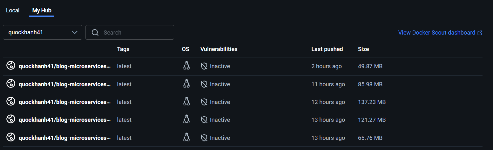

**Bước 2: Tạo Railway project**
1. Truy cập Railway.app
2. Create new project (Empty Project)
3. Không cần connect GitHub repository

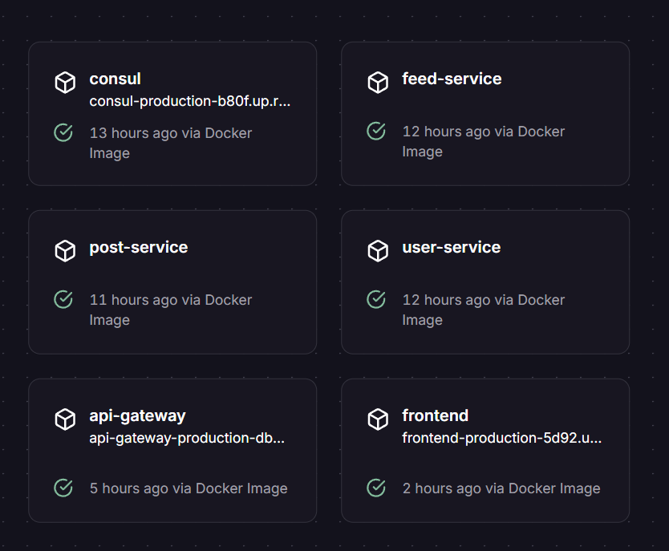

**Bước 3: Deploy services theo thứ tự (quan trọng!)**

##### 1. Consul Service (Service Discovery)
- **Deployment Method**: Docker Image
- **Docker Image**: `hashicorp/consul`
- **Port**: 8500
- **Environment Variables**: Không cần

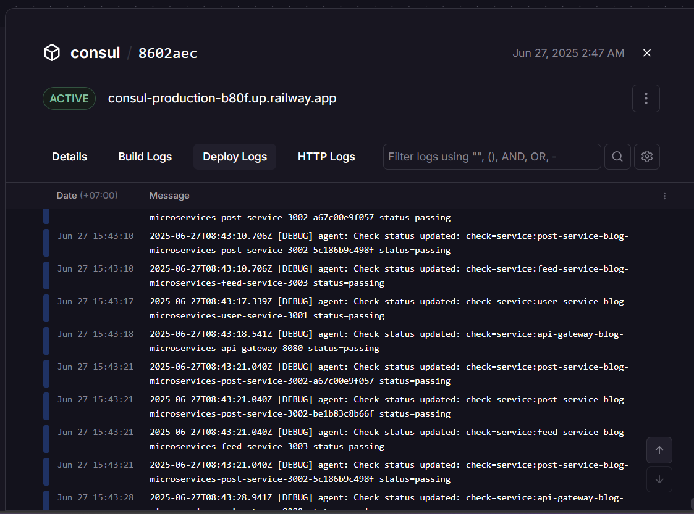

##### 2. User Service
- **Deployment Method**: Docker Image
- **Docker Image**: `quockhanh41/blog-microservices-user-service`
- **Port**: 3001
- **Environment Variables**:
```env
DATABASE_URL=postgresql://[railway-postgres-url]
JWT_SECRET=your-secret-key
CONSUL_HOST=[consul-service-internal-url]
CONSUL_PORT=8500
```

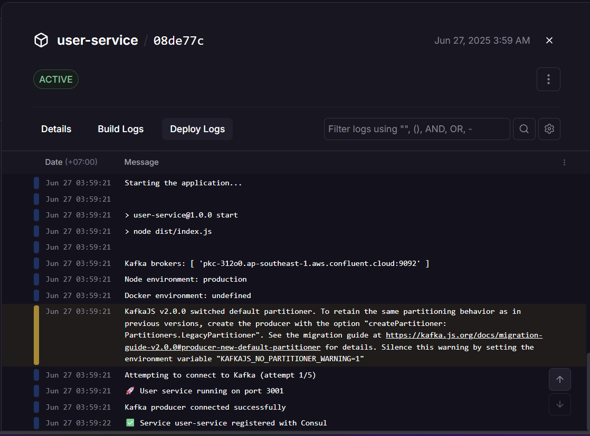

##### 3. Post Service
- **Deployment Method**: Docker Image
- **Docker Image**: `quockhanh41/blog-microservices-post-service`
- **Port**: 3002
- **Environment Variables**:
```env
DATABASE_URL=postgresql://[railway-postgres-url]
JWT_SECRET=your-secret-key
CONSUL_HOST=[consul-service-internal-url]
CONSUL_PORT=8500
KAFKA_BROKERS=[kafka-broker-url]
```

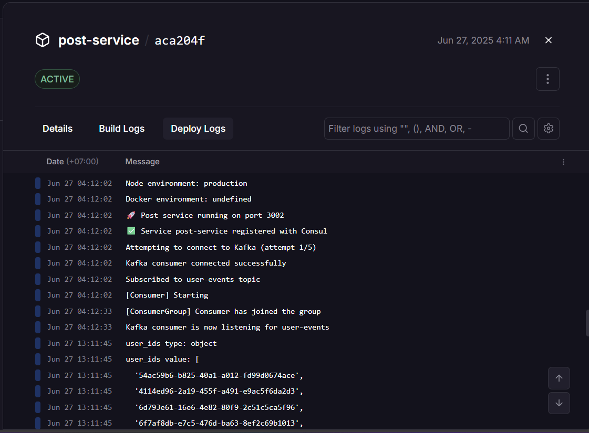

##### 4. Feed Service
- **Deployment Method**: Docker Image
- **Docker Image**: `quockhanh41/blog-microservices-feed-service`
- **Port**: 3003
- **Environment Variables**:
```env
REDIS_URL=redis://[railway-redis-url]
CONSUL_HOST=[consul-service-internal-url]
CONSUL_PORT=8500
USER_SERVICE_URL=[user-service-internal-url]
POST_SERVICE_URL=[post-service-internal-url]
```

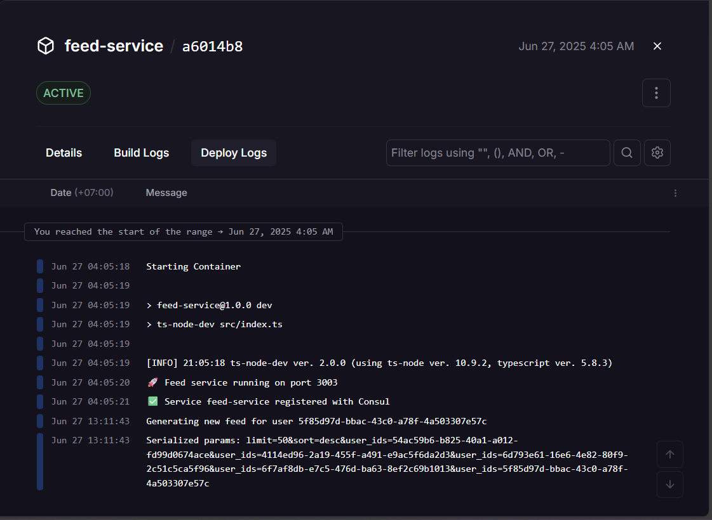

##### 5. API Gateway
- **Deployment Method**: Docker Image
- **Docker Image**: `quockhanh41/blog-microservices-api-gateway`
- **Port**: 8080
- **Environment Variables**:
```env
CONSUL_HOST=[consul-service-internal-url]
CONSUL_PORT=8500
USER_SERVICE_URL=[user-service-internal-url]
POST_SERVICE_URL=[post-service-internal-url]
FEED_SERVICE_URL=[feed-service-internal-url]
```

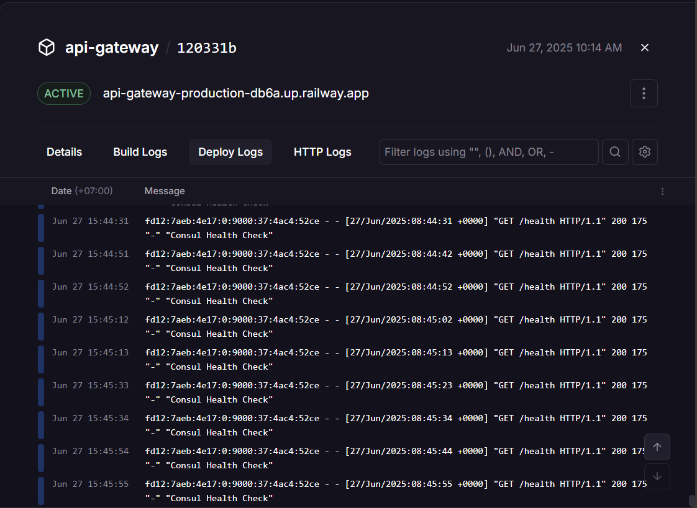

##### 6. Frontend
- **Deployment Method**: Docker Image
- **Docker Image**: `quockhanh41/blog-microservices-frontend`
- **Port**: 3000
- **Environment Variables**:
```env
NEXT_PUBLIC_API_URL=[api-gateway-public-url]
```

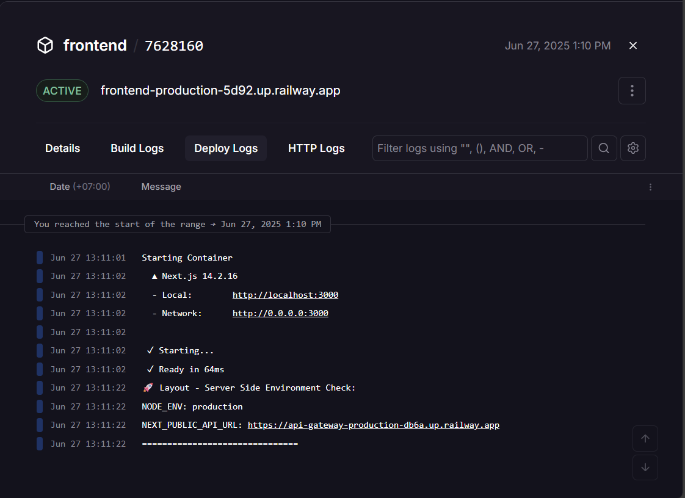

**Bước 4: Configure managed databases**

##### PostgreSQL Database
- Service: NEON PostgreSQL
- Connection URL: Sử dụng cho User Service và Post Service

##### Redis Database
- Service: Redis Cloud
- Connection URL: Sử dụng cho Feed Service

**Bước 5: Cấu hình Service Dependencies và Networking**

Sau khi mỗi service được deploy, sử dụng thông tin của service đó để cấu hình cho các service tiếp theo:

1. **Consul URL**: Lấy internal URL của Consul service
2. **Database URLs**: Từ Redis Cloud và NEON
3. **Service Internal URLs**: Sử dụng Railway private networking

**Bước 6: Environment Variables tổng hợp**
```env
# Infrastructure Services
CONSUL_HOST=consul-production.railway.internal
CONSUL_PORT=8500
DATABASE_URL=
REDIS_URL=

# Service Internal URLs (Railway Private Network)
USER_SERVICE_URL=https://user-service-production.railway.internal:3001
POST_SERVICE_URL=https://post-service-production.railway.internal:3002
FEED_SERVICE_URL=https://feed-service-production.railway.internal:3003
API_GATEWAY_URL=https://api-gateway-production.railway.internal:8080

# Public URLs (for Frontend)
NEXT_PUBLIC_API_URL=https://api-gateway-production.up.railway.app

# Authentication
JWT_SECRET=your-secret-key

# External Services 
KAFKA_BROKERS=your-kafka-broker-url
```


### 📊 Kết Quả

#### ⚠️ Lưu Ý Quan Trọng
**Về Railway Deployment**: 
- Dự án này được deploy sử dụng gói **Railway Standard** để demo
- Gói này có **thời hạn 1 tháng** kể từ ngày triển khai (24/6/2025)
- **Nếu không thể truy cập các URLs bên dưới**, có nghĩa là gói đã hết hạn
- Đây là hạn chế về chi phí, không phải lỗi kỹ thuật trong quá trình deployment
- Mong thầy thông cảm cho việc này! 🙏

#### Deployment Status
**Trạng thái**: ✅ Thành công triển khai tất cả services
**Ngày deploy**: 24/6/2025
**Thời hạn**: ~24/7/2025 (1 tháng)

#### Service URLs
- **Frontend**: https://frontend-production-5d92.up.railway.app/
- **API Gateway**: https://api-gateway-production-db6a.up.railway.app/
- **Consul UI**: https://consul-production-b80f.up.railway.app/ui/
**Internal Services** (accessible via Railway private network):
- **User Service**: https://user-service-production.railway.internal:3001
- **Post Service**: https://post-service-production.railway.internal:3002
- **Feed Service**: https://feed-service-production.railway.internal:3003


### ✅ Ưu Điểm
- Zero configuration deployment với pre-built Docker images
- Automatic scaling và managed infrastructure
- Built-in monitoring và health checks
- Easy collaboration với team
- Automatic HTTPS cho public endpoints
- Private networking giữa các services
- Managed databases (PostgreSQL, Redis)

### ❌ Nhược Điểm
- Cost cho production usage
- Cần quản lý Docker images trên Docker Hub
- Limited customization compared to self-hosted
- Vendor lock-in với Railway platform
- Phụ thuộc vào Docker Hub availability

### 🔍 Deployment Process Flow
1. **Infrastructure First**: Consul cho service discovery
2. **Core Services**: User và Post services với database connections
3. **Dependent Services**: Feed service phụ thuộc vào User/Post services
4. **Gateway Layer**: API Gateway routing tất cả requests
5. **Frontend**: Client application connect qua API Gateway

### 📊 Service Dependencies Chart
```
Consul (Service Discovery)
    ↓
User Service ← PostgreSQL
    ↓
Post Service ← PostgreSQL ← Kafka
    ↓
Feed Service ← Redis ← User/Post Services
    ↓
API Gateway ← All Services
    ↓
Frontend ← API Gateway
```

### 🔍 Health Monitoring
**Hình ảnh**: [Đính kèm screenshots Railway health monitoring]

---

## 📊 So Sánh Các Phương Pháp

| Tiêu chí | PM2 | Docker Compose | Railway |
|----------|-----|----------------|---------|
| **Độ phức tạp setup** | ⭐⭐⭐ | ⭐⭐⭐⭐ | ⭐⭐ |
| **Isolation** | ⭐⭐ | ⭐⭐⭐⭐⭐ | ⭐⭐⭐⭐⭐ |
| **Scalability** | ⭐⭐⭐ | ⭐⭐⭐⭐ | ⭐⭐⭐⭐⭐ |
| **Cost** | ⭐⭐⭐⭐⭐ (Free) | ⭐⭐⭐⭐⭐ (Free) | ⭐⭐⭐ (Paid) |
| **Monitoring** | ⭐⭐⭐⭐ | ⭐⭐⭐ | ⭐⭐⭐⭐⭐ |
| **Production Ready** | ⭐⭐⭐ | ⭐⭐⭐⭐ | ⭐⭐⭐⭐⭐ |

## 🎯 Kết Luận

### Khuyến Nghị Sử Dụng

#### Development Environment
- **PM2**: Phù hợp cho development và testing local
- **Docker Compose**: Phù hợp cho development team và staging

#### Production Environment
- **Railway**: Phù hợp cho production với budget và cần managed infrastructure
- **Docker Compose**: Phù hợp cho production self-hosted với full control

### Bài Học Kinh Nghiệm

1. **PM2**:
   - Cần cài đặt và cấu hình infrastructure dependencies manually
   - Tốt cho rapid development và debugging
   - Require system-level dependencies

2. **Docker Compose**:
   - Cần hiểu về Docker và containerization
   - Excellent cho reproducible environments
   - Resource overhead cần được consider

3. **Railway**:
   - Sử dụng pre-built Docker images từ Docker Hub
   - Deploy theo thứ tự dependencies (Consul → Services → Gateway → Frontend)
   - Automatic scaling và managed services
   - Cần quản lý thông tin service URLs cho inter-service communication


---

**Ngày hoàn thành**: [24/6/2025]  
**Tài liệu được tạo bởi**: [Nguyễn Quốc Khánh - 22127188]  
**Version**: 1.0
